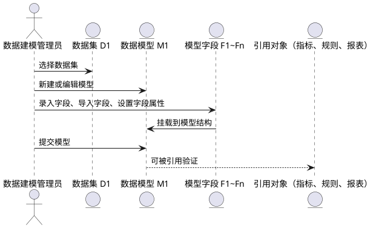
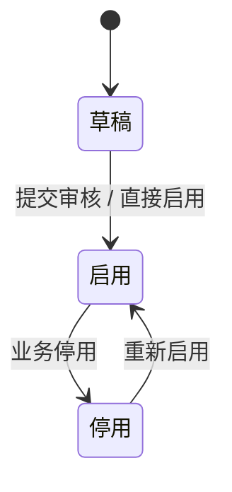
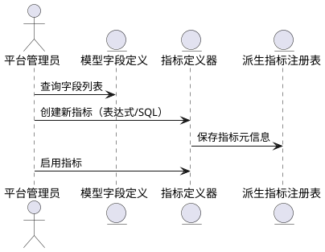
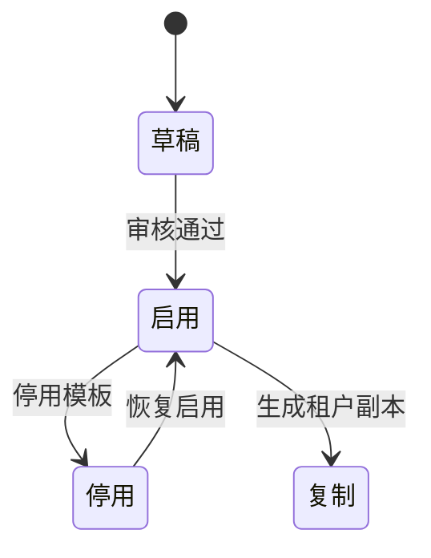
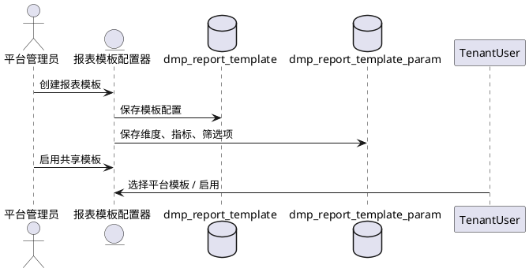
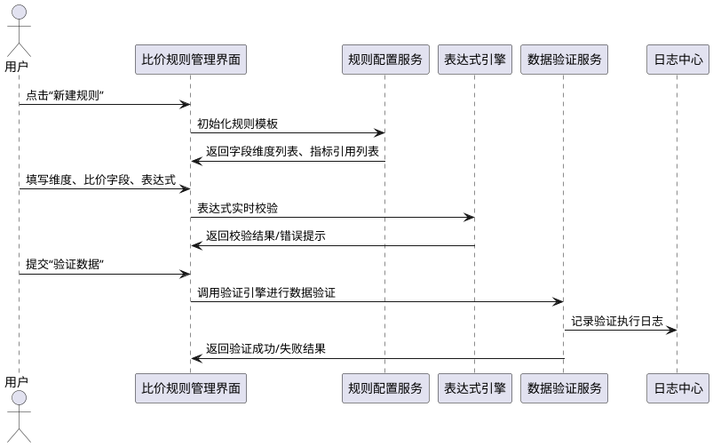

# 平台端模块

## 七、分析主题与数据集管理模块

---

### 7.1 分析主题管理

#### 7.1.1 功能概述：

*   **功能说明**：分析主题用于归集平台侧分析类工作的主题边界，为后续数据集、字段、指标等提供归属结构。分析主题也作为报表模板的挂载目录单位。
    
*   **关键用户**：平台运营管理员、数据产品经理
    
*   **前置依赖准备**：
    
    *   已完成租户模型初始化
        
    *   数据集与模型结构已支持挂载主题分类
        
    *   已配置好 UIM 平台端权限角色
        

---

#### 7.1.2 状态机：

| 状态 | 描述 | 可流转操作 |
| --- | --- | --- |
| 草稿 | 初始创建状态 | 提交审核、删除 |
| 启用 | 当前可用于数据集挂载 | 停用、编辑基本信息 |
| 停用 | 禁止新建数据集挂载 | 启用 |

---

#### 7.1.3 分析主题列表页面功能

##### 7.1.3.1 主要功能

| 功能名称 | 前置条件 | 后置执行结果 |
| --- | --- | --- |
| 新增分析主题 | 无 | 创建草稿状态分析主题 |
| 编辑分析主题 | 状态为草稿或停用 | 打开编辑详情页 |
| 启用分析主题 | 状态为草稿或停用 | 状态变更为启用，支持被数据集挂载 |
| 停用分析主题 | 状态为启用 | 状态变更为停用，禁止新挂载 |
| 删除分析主题 | 状态为草稿 | 彻底删除该主题 |
| 搜索/筛选主题 | 无 | 支持按关键词、状态、负责人筛选 |

##### 7.1.3.2 页面字段

| 字段名称 | 字段编码 | 字段类型 | 字段说明 |
| --- | --- | --- | --- |
| 主题名称 | subject\_name | String | 分析主题的名称 |
| 主题编码 | subject\_code | String | 平台唯一编码，用于挂载与索引 |
| 描述 | description | Text | 用于说明主题的使用范围与说明 |
| 状态 | status | Enum | 草稿 / 启用 / 停用 |
| 创建人 | created\_by | String | 创建用户名称 |
| 创建时间 | created\_at | DateTime | 创建时间戳 |

##### 7.1.3.3 重点功能算法逻辑说明

*   **主题编码唯一性校验**：主题编码需在平台内唯一，新增与编辑时做重复校验。
    
*   **停用逻辑保护**：若当前主题下已挂载数据集，停用前需提示风险，允许但需用户二次确认。
    
*   **搜索逻辑**：支持对名称、编码、描述模糊搜索，支持状态精确筛选。
    

---

#### 7.1.4 新增 / 编辑分析主题页面功能

##### 7.1.4.1 主要功能

| 功能名称 | 前置条件 | 后置执行结果 |
| --- | --- | --- |
| 填写主题名称 | 无 | 检查字符合法性 |
| 设置主题编码 | 无 | 校验唯一性 |
| 填写描述信息 | 可选 | 支持多行输入 |
| 保存 | 信息填写完整 | 返回列表页并提示成功 |
| 启用/停用操作 | 已保存 | 状态字段切换并刷新数据 |

##### 7.1.4.2 页面字段

| 字段名称 | 字段编码 | 字段类型 | 说明 |
| --- | --- | --- | --- |
| 主题名称 | subject\_name | Input | 必填，支持中文名，限制100字符内 |
| 主题编码 | subject\_code | Input | 必填，英文字母+数字，不能重复 |
| 描述 | description | TextArea | 非必填，支持换行与粘贴文本 |

##### 7.1.4.3 算法逻辑说明

*   **保存校验规则**：
    
    *   subject\_name 不为空，长度限制；
        
    *   subject\_code 不为空且唯一，不能重复；
        
*   **编辑保护规则**：
    
    *   若为“启用”状态，仅允许编辑描述字段，不可修改编码和名称。
        

### 7.2 数据集管理

---

#### 7.2.1 功能概述：

*   **功能说明**：数据集是用于支撑报表模板、比价规则、指标分析的基础数据单元，可绑定分析主题，并关联数据模型、字段及维度。支持区分来源（平台/租户/业务），可定义数据权限策略。
    
*   **关键用户**：平台数据建模人员、运营配置管理员
    
*   **前置依赖准备**：
    
    *   分析主题已创建；
        
    *   模型与字段已初步定义；
        
    *   数据权限模型已加载。
        

---

#### 7.2.2 状态机：

| 状态 | 描述 | 可流转操作 |
| --- | --- | --- |
| 草稿 | 创建中，未启用 | 编辑、删除、启用 |
| 启用 | 可供指标、规则、模板使用 | 停用 |
| 停用 | 禁止挂载 | 启用、编辑 |

---

#### 7.2.3 数据集列表页面功能

##### 7.2.3.1 主要功能

| 功能名称 | 前置条件 | 后置执行结果 |
| --- | --- | --- |
| 新增数据集 | 已有分析主题 | 创建草稿数据集 |
| 编辑数据集 | 状态为草稿或停用 | 进入编辑页 |
| 启用数据集 | 状态为草稿或停用 | 启用后可被模板、指标等调用 |
| 停用数据集 | 状态为启用 | 停用后不可被引用 |
| 删除数据集 | 状态为草稿 | 彻底删除数据集 |
| 筛选/搜索数据集 | 无 | 按名称、编码、状态、类型等搜索 |

##### 7.2.3.2 页面字段

| 字段名称 | 字段编码 | 字段类型 | 字段说明 |
| --- | --- | --- | --- |
| 数据集名称 | dataset\_name | String | 中文名，用户识别与展示 |
| 数据集编码 | dataset\_code | String | 系统唯一，用于模板引用 |
| 数据集类型 | dataset\_type | Enum | 平台数据 / 租户数据 / 本地业务数据 |
| 分析主题 | subject\_code | Reference | 所属分析主题 |
| 来源模型 | model\_code | Reference | 绑定的数据模型编码 |
| 状态 | status | Enum | 草稿、启用、停用 |

##### 7.2.3.3 重点功能算法逻辑说明

*   **数据集编码唯一性校验**：平台范围内唯一，系统创建时自动校验。
    
*   **引用保护机制**：若已有报表模板、指标引用该数据集，禁用需提示影响项。
    
*   **搜索性能优化**：分页加载、支持懒加载与异步搜索分析主题与模型字段。
    

---

#### 7.2.4 新增 / 编辑数据集页面功能

##### 7.2.4.1 主要功能

| 功能名称 | 前置条件 | 后置执行结果 |
| --- | --- | --- |
| 选择分析主题 | 已存在分析主题 | 数据集挂载该主题，分类归属明确 |
| 选择数据模型 | 已建模字段结构 | 确定数据字段结构来源 |
| 设置数据集类型 | 手动选择 | 决定是否为平台/租户/本地业务数据 |
| 设置可见性 | 系统自动/手动控制 | 默认平台数据全租户可见 |
| 保存 | 表单校验通过 | 返回列表页，状态为草稿 |

##### 7.2.4.2 页面字段

| 字段名称 | 字段编码 | 字段类型 | 字段说明 |
| --- | --- | --- | --- |
| 数据集名称 | dataset\_name | Input | 必填，支持中文名称 |
| 数据集编码 | dataset\_code | Input | 必填，英文字母+数字 |
| 分析主题 | subject\_code | Select | 必填，下拉或搜索选项 |
| 数据集类型 | dataset\_type | Radio/Select | 必填，平台/租户/本地 |
| 来源模型 | model\_code | Select | 必填，选择已有数据模型 |

##### 7.2.4.3 算法逻辑说明

*   **启用校验规则**：
    
    *   数据集至少绑定一个数据模型字段；
        
    *   数据集名称与编码均填写，编码唯一；
        
*   **字段变更提示**：
    
    *   若修改绑定模型，需提示已引用模板、指标将受影响；
        
*   **类型联动规则**：
    
    *   若为平台数据集，默认平台所有租户可读；
        
    *   若为租户数据集，仅租户内可见，支持权限配置。
        

## 八、模型与字段管理模块

### 8.1 功能概述

| 项目 | 描述 |
| --- | --- |
| **功能说明** | 提供平台侧对数据集下的数据模型（逻辑表）及其字段的统一建模与管理能力。支持数据模型结构化维护（含字段属性、字段分组、字段状态管理）、模型字段引用校验、字段变更记录追踪、字段引用指标校验等。该模块是派生指标、比价规则、报表模板等上层能力的底层结构基础。 |
| **关键用户** | 平台数据建模管理员、数据架构师、数据分析产品负责人 |
| **前置依赖准备** | 1. 已创建分析主题与数据集（见模块七）<br>2. 明确字段类型标准与指标字段引用规范<br>3. 明确模型所属数据集及其用途 |

---

#### 8.1.1 状态机

**数据模型状态：**

```plaintext
[草稿] → [启用] → [停用]

```

*   草稿：模型未发布，可自由调整字段结构；
    
*   启用：模型已生效，受指标、报表引用约束；
    
*   停用：模型废弃，仅保留结构供历史查看；
    

**字段状态：**

```plaintext
[有效] → [作废]
[草稿态字段] → [删除]

```

*   有效：字段可使用；
    
*   作废：不可引用，保留展示；
    
*   删除：草稿态字段可物理删除；
    

---

### 8.2 操作时序图（建模过程）



---

### 8.3 页面功能说明

---

#### 8.3.1 模型与字段列表页功能说明

| 功能项 | 前置条件 | 后置结果 |
| --- | --- | --- |
| 查询模型列表 | 已选分析主题与数据集 | 返回所选数据集下的模型结构 |
| 新增数据模型 | 数据集存在 | 进入模型新增页面，初始化空结构 |
| 编辑数据模型 | 模型为草稿状态 | 可修改模型字段结构与字段信息 |
| 启用/停用模型 | 模型启用后 | 状态变更，触发引用检查 |
| 查看字段列表 | 模型存在 | 显示模型字段结构化视图 |
| 字段批量导入 | 模型为草稿 | 自动识别字段结构并生成草稿字段 |
| 字段批量变更 | 模型启用后 | 创建字段变更记录，进入审批流程 |
| 查看字段引用 | 字段存在 | 展示被引用的指标、报表等结构 |

---

### 8.4 页面字段清单

#### 8.4.1 数据模型字段结构

| 字段名称 | 字段编码 | 字段类型 | 说明 |
| --- | --- | --- | --- |
| 模型名称 | model\_name | String | 数据模型展示名称 |
| 模型编码 | model\_code | String | 系统唯一编码 |
| 所属数据集 | data\_set\_code | String | 绑定数据集 |
| 描述信息 | description | Text | 可选补充说明 |
| 启用状态 | status | Enum | 草稿 / 启用 / 停用 |
| 字段结构 | field\_list | List<Object> | 嵌套字段信息列表 |

#### 8.4.2 模型字段结构

| 字段名称 | 字段编码 | 字段类型 | 字段说明 |
| --- | --- | --- | --- |
| 字段名称 | field\_name | String | 中文字段名称 |
| 字段编码 | field\_code | String | 系统唯一标识符 |
| 数据类型 | data\_type | Enum | 支持 String、Decimal、Long、Date、Boolean 等 |
| 是否主键 | is\_pk | Boolean | 是否模型主键 |
| 是否必填 | is\_required | Boolean | 是否为必填项 |
| 是否派生字段 | is\_derived | Boolean | 是否为计算派生 |
| 字段状态 | status | Enum | 有效 / 作废 |
| 字段分组 | group\_name | String | 可用于字段分类展示 |
| 来源字段 | ref\_field\_code | String | 若字段来自外部字段引用，记录原字段编码 |

---

#### 8.4.3  重点功能算法逻辑说明

**字段引用检查逻辑：**

*   当模型字段被指标、规则、报表引用时，模型结构锁定不可直接删除或更改字段编码。
    

*   允许新增字段、允许作废字段（但需提示是否影响引用对象）。
    

**字段差异比对算法：**

*   支持同数据集下的不同模型进行字段结构比对，输出字段新增、缺失、名称差异等差异报告。
    

适用于字段结构同步更新或模型标准化管理场景。

**字段变更影响分析：**

*   系统记录字段变更历史（变更字段、变更前后、时间、操作者）；
    
*   若字段被引用，展示影响路径树（模型 → 指标 → 报表模板）；
    

---

### 8.5 字段交互设计优化说明

为支持用户高效建模，需提供以下交互能力：

1.  **字段三视图切换**：
    
    *   按分组显示；
        
    *   已选字段；
        
    *   历史作废字段；
        
2.  **字段批量操作支持**：
    
    *   字段导入（Excel或SQL）；
        
    *   字段快速复制；
        
    *   字段批量分组、批量状态修改；
        
3.  **字段引用提示与跳转**：
    
    *   若字段已被引用，提示并可跳转至引用对象；
        
    *   禁止误删、误改被引用字段；
        
4.  **字段变更草稿机制**：
    
    *   已启用模型字段修改，需创建草稿副本；
        
    *   修改需审批或记录变更日志；
        

## 九、维度与指标定义模块（含派生指标能力）

### 9.1 功能概述：

**功能说明：**  
本模块用于统一管理分析系统中涉及的维度、原始指标、派生指标等数据分析基础内容，是平台端构建数据分析体系和共享指标能力的核心模块。支持通过 DSL 表达式或 SQL 实现指标定义，支持原子指标引用模型字段，支持定义维度项、度量项及其属性与分组，并可被租户端继承使用。

**关键用户：**  
平台管理员、BI 架构师、数据分析工程师

**前置依赖准备：**

*   已完成数据模型及字段配置（见第八章）
    
*   已完成数据集、分析主题挂载（见第七章）
    
*   已建立指标引用的数据权限模型
    

---

### 9.1.1 状态机：




---

### 9.1.2 操作时序图：



---

### 9.1.3 指标维护页面功能

#### 9.1.3.1 主要功能：

| 功能名称 | 前置条件 | 后置执行结果 |
| --- | --- | --- |
| 创建指标 | 已选数据模型/字段 | 新增指标草稿记录 |
| 编辑指标 | 存在指标记录 | 修改指标定义 |
| 启用/停用指标 | 草稿/启用状态 | 指标状态更新 |
| 指标派生方式选择 | 无 | DSL / SQL 两种派生逻辑切换 |
| 指标引用字段校验 | 已选择模型字段 | 系统自动校验合法性 |
| 表达式语法校验 | 使用 DSL 表达式 | 自动提示表达式错误 |
| SQL 输出字段映射 | 使用 SQL 方式 | 系统引导绑定输出字段名称 |
| 指标预览 | 表达式或 SQL 正确 | 输出样例数据 |

---

#### 9.1.3.2 页面字段说明：

| 字段名称 | 字段编码 | 字段类型 | 字段说明 |
| --- | --- | --- | --- |
| 指标名称 | indicator\_name | String | 用户定义的指标名称 |
| 指标编码 | indicator\_code | String | 系统唯一编码 |
| 所属数据集 | dataset\_id | Reference | 挂载的数据集 |
| 所属模型 | model\_id | Reference | 所在数据模型 |
| 指标类型 | indicator\_type | Enum | 原子指标 / 派生指标 |
| 数据类型 | data\_type | Enum | 数值 / 文本 / 布尔等 |
| 派生方式 | derive\_type | Enum | DSL / SQL |
| 派生表达式 | derive\_expression | Text / SQL | DSL 表达式或 SQL 脚本 |
| 输出字段映射 | output\_mapping | Map | SQL 输出字段 → 指标名 |
| 适用范围 | scope\_type | Enum | 平台 / 租户共享 |
| 状态 | status | Enum | 草稿 / 启用 / 停用 |

---

#### 9.1.3.3 重点功能算法逻辑说明：

*   **表达式指标：**
    
    *   表达式为 DSL，如 `max(price) / avg(price)`；
        
    *   字段校验逻辑包括存在性、数据类型兼容；
        
    *   若公式引用字段失效，标记为“需重构”。
        
*   **SQL 指标：**
    
    *   支持 SELECT 查询语句，不支持数据修改；
        
    *   必须输出结构：`select xxx as alias_1, yyy as alias_2 ...`;
        
    *   每个字段须绑定一个指标名称，用于 S2 报表映射；
        
    *   SQL 中引用模型字段需为当前数据集范围内。
        
*   **输出字段与指标名的映射机制：**
    
    *   多字段输出的 SQL，用户需手动指定哪些字段作为哪些指标；
        
    *   一条 SQL 可注册多个指标（如：均价、最高价、价格差等）。
        

---

### 9.1.4 派生指标类型扩展说明

| 指标类型 | 说明 |
| --- | --- |
| 原子指标 | 引用模型字段，如 `price`、`brand` 等 |
| 简单派生指标 | 使用表达式组合字段，如 `price * quantity` |
| 复杂派生指标 | 需通过 SQL 实现，如聚合过滤、多表联查 |

---

### 9.1.5 复杂派生指标定义页面（补充）

| 功能名称 | 前置条件 | 后置执行结果 |
| --- | --- | --- |
| 创建复杂派生指标 | 已选模型 | 新增指标并写入 SQL 脚本 |
| 测试 SQL 输出字段 | SQL 合法 | 展示样本数据 |
| 输出字段 → 指标名映射 | 有 SQL 输出字段 | 建立指标绑定关系 |
| 表达式 + SQL 混合预览能力 | 系统支持 | 提供指标组合分析预览 |

---

**复杂指标示例**：

| 指标名称 | 示例 SQL 逻辑描述 |
| --- | --- |
| 同产品最低价 | `SELECT sku_code, MIN(price) ...` |
| 倒挂判断 | `CASE WHEN purchase_price > sale_price THEN 1 ELSE 0 END` |
| 集团最大品牌指标价 | 基于采购额聚合后再联表取价 |
| 政策综合评分 | 各项设备政策指标加权平均 |

---

## 十、报表模板管理模块（含 S2 报表配置、共享控制）

### 10.1 功能概述：

**功能说明：**  
该模块用于平台侧统一配置分析报表模板，作为可视化比价分析的视图层模板，模板结构基于 Antv S2 透视表框架，可配置行维度、列维度、指标项、筛选项、布局结构，并支持字段组合与父子列头设置。平台配置的模板可共享给租户端使用，租户可启用或复制模板自定义扩展。

**关键用户：**  
平台分析负责人、BI 架构师、租户集团分析管理员

**前置依赖准备：**

*   已定义数据集、数据模型与字段（见第七、八章）
    
*   已配置维度与指标项（见第九章）
    
*   租户端已接入数据权限模型
    

---

### 10.1.1 状态机：


---

### 10.1.2 操作时序图：



---

### 10.1.3 报表模板列表页面功能

#### 10.1.3.1 主要功能：

| 功能名称 | 前置条件 | 后置执行结果 |
| --- | --- | --- |
| 创建报表模板 | 已挂载数据集/模型 | 新增报表模板草稿 |
| 编辑报表模板 | 模板为草稿/停用状态 | 进入模板配置器编辑 |
| 启用模板 | 配置项完整 | 设置为平台共享模板 |
| 停用模板 | 已启用模板 | 租户不可再启用该模板 |
| 查看模板详情 | 任意状态模板 | 查看字段配置、布局结构等 |
| 复制为租户模板 | 平台模板启用状态 | 生成可编辑的租户模板副本 |
| 删除模板 | 草稿/停用状态模板 | 删除配置 |
| 搜索筛选模板 | 无 | 支持按名称、编码、状态、数据集等搜索筛选 |
| 模板分类管理 | 无 | 支持为模板设置分类标签，便于管理 |
| 批量操作 | 选中多个模板 | 支持批量启用、停用、删除等操作 |
| 模板使用统计 | 模板已启用 | 查看模板被租户使用的统计信息 |

---

#### 10.1.3.2 页面字段清单：

| 字段名称 | 字段编码 | 字段类型 | 字段说明 |
| --- | --- | --- | --- |
| 报表模板名称 | template\_name | String | 自定义报表名称 |
| 模板编码 | template\_code | String | 系统唯一编码 |
| 所属数据集 | dataset\_id | Reference | 绑定数据集编码 |
| 是否共享 | is\_shared | Boolean | 是否对租户共享 |
| 状态 | status | Enum | 草稿、启用、停用 |
| 模板描述 | description | Text | 模板用途说明 |
| 模板分类 | category | String | 模板分类标签，如：采购分析、财务分析等 |
| 模板标签 | tags | Array | 模板标签列表，支持多标签 |
| 配置结构 | config\_json | JSON | Antv S2 行列维度+指标结构 |
| 创建人 | created\_by | String | 模板创建者 |
| 创建时间 | created\_time | Datetime | 模板创建时间 |
| 更新时间 | update\_time | Datetime | 最后更新记录 |
| 使用次数 | usage\_count | Integer | 模板被租户使用的次数统计 |

---

#### 10.1.3.3 报表配置器算法说明：

*   **数据源映射逻辑**：
    
    *   绑定数据集 → 模型 → 字段、指标、维度；
        
    *   报表字段来源自动联动绑定指标系统。
        
*   **列头配置逻辑**：
    
    *   支持“字段组合列头”：如“供应商名称 + 采购模式”；
        
    *   支持父子结构：列维度结构为“品牌 > 型号 > 组织”。
        
*   **指标项绑定逻辑**：
    
    *   所有指标来自第九章定义；
        
    *   每一指标项支持格式设置、单位标识、差异率高亮等。
        
*   **筛选项支持**：
    
    *   报表模板可预设筛选项，如组织、品牌、时间；
        
    *   支持设定是否强制筛选（默认值 / 可修改）；
        
    *   支持多种筛选字段类型：文本、数值、日期、枚举、布尔等；
        
    *   支持多种筛选操作符：等于、不等于、大于、小于、包含、不包含、在范围内、不在范围内等；
        
    *   支持表达式编辑器，提供字段联想、语法高亮、实时校验功能；
        
    *   支持筛选条件组合：AND、OR逻辑组合，支持括号分组；
        
    *   支持筛选条件模板保存与复用。
        

---

### 10.1.4 报表模板新建编辑器页面功能

#### 10.1.4.1 报表模板编辑功能：

| 功能名称 | 前置条件 | 后置结果 |
| --- | --- | --- |
| 选择数据集与模型 | 数据集已启用 | 拉取字段清单作为维度与指标候选项 |
| 配置行维度 | 可多选字段 | 报表行轴维度确定 |
| 配置列维度 | 可多选字段 | 列轴维度确定 |
| 选择指标项 | 来自指标系统 | 绑定指标并定义展示顺序 |
| 设置筛选项 | 维度字段为候选 | 可配置默认值、必填性、操作符、字段类型等 |
| 配置筛选表达式 | 支持表达式编辑器 | 提供字段联想、语法校验、逻辑组合功能 |
| 筛选条件测试 | 筛选表达式配置完成 | 验证筛选逻辑正确性，预览筛选结果 |
| 设置展示样式 | 含字段宽度、单位等 | 表格字段展示优化 |
| 指标表达式预览 | 表达式型指标 | 显示指标计算结果示意 |
| 报表模板预览 | 配置完整后 | 渲染 Antv S2 报表样例 |

---

#### 10.1.4.2 页面字段（配置器表单）：

| 字段名称 | 字段编码 | 字段类型 | 字段说明 |
| --- | --- | --- | --- |
| 行维度 | row\_dimensions | List | 来自数据模型维度字段 |
| 列维度 | col\_dimensions | List | 支持字段组合（父子结构） |
| 指标项 | indicator\_fields | List | 绑定指标编码 |
| 筛选条件 | filters | List | 配置默认值、是否必填、字段类型、操作符等 |
| 筛选表达式 | filter_expressions | JSON | 复杂筛选逻辑表达式，支持AND/OR组合 |
| 筛选字段配置 | filter_field_config | JSON | 筛选字段的类型、操作符、默认值等配置 |
| 展示结构配置 | layout\_config | JSON | 表格行列布局，字段组合方式等 |
| 高亮配置 | highlight\_rules | JSON | 差异率、倒挂、风险高亮条件 |

---

### 10.1.5 平台与租户模板共享控制

| 操作项 | 说明 |
| --- | --- |
| 平台共享启用 | 平台设置模板为共享后，租户可选择使用 |
| 租户启用模板 | 选择启用平台模板，但不可修改其内容 |
| 租户复制模板 | 基于平台模板生成副本，自行配置 |
| 租户模板继承模型 | 租户模板引用平台字段、指标，不可修改 |
| 平台可查看使用情况 | 可查看租户使用模板数、启用状态等 |

---

### 10.1.6 报表模板数据校验与测试

#### 10.1.6.1 模板配置校验功能：

| 功能名称 | 前置条件 | 后置结果 |
| --- | --- | --- |
| 字段依赖校验 | 模板配置完成 | 检查所引用字段、指标是否存在且有效 |
| 筛选条件语法校验 | 筛选表达式配置 | 验证表达式语法正确性，提示错误位置 |
| 数据权限校验 | 模板绑定数据集 | 检查租户对数据集字段的访问权限 |
| 模板结构校验 | 行列维度配置 | 验证维度组合的合理性，避免数据爆炸 |
| 指标计算校验 | 指标项配置 | 测试指标计算逻辑，预览计算结果 |

#### 10.1.6.2 模板测试预览功能：

| 功能名称 | 说明 |
| --- | --- |
| 样本数据预览 | 基于配置生成样本报表，验证展示效果 |
| 性能测试 | 评估模板在大数据量下的查询性能 |
| 筛选条件测试 | 测试各种筛选条件组合的执行效果 |
| 跨租户兼容性测试 | 验证模板在不同租户环境下的兼容性 |

---

### 10.1.7 模板导入导出与版本管理

#### 10.1.7.1 模板导入导出功能：

| 功能名称 | 前置条件 | 后置结果 |
| --- | --- | --- |
| 模板导出 | 模板已配置完成 | 生成JSON格式的模板配置文件 |
| 模板导入 | 有效的模板配置文件 | 解析并创建新的报表模板 |
| 批量导入 | 多个模板配置文件 | 批量创建多个报表模板 |
| 导入校验 | 导入前预校验 | 检查模板配置的完整性和兼容性 |
| 冲突处理 | 导入时发现重复 | 提供覆盖、跳过、重命名等处理选项 |

#### 10.1.7.2 版本管理功能：

| 功能名称 | 说明 |
| --- | --- |
| 版本记录 | 自动记录模板的每次修改，生成版本历史 |
| 版本对比 | 对比不同版本间的配置差异 |
| 版本回滚 | 支持回滚到历史版本 |
| 版本标签 | 为重要版本添加标签和说明 |
| 变更日志 | 记录每次变更的详细说明和操作人 |

---

### 10.1.8 权限控制与安全管理

#### 10.1.8.1 模板权限控制：

| 权限类型 | 说明 |
| --- | --- |
| 模板创建权限 | 控制哪些用户可以创建新的报表模板 |
| 模板编辑权限 | 控制哪些用户可以编辑特定模板 |
| 模板共享权限 | 控制哪些用户可以将模板设为共享状态 |
| 模板删除权限 | 控制哪些用户可以删除模板 |
| 数据访问权限 | 基于数据集权限控制模板可访问的数据范围 |

#### 10.1.8.2 安全审计功能：

| 功能名称 | 说明 |
| --- | --- |
| 操作日志记录 | 记录所有模板相关操作的详细日志 |
| 敏感操作审批 | 对删除、共享等敏感操作要求审批流程 |
| 数据脱敏 | 在模板预览中对敏感数据进行脱敏处理 |
| 访问监控 | 监控模板的使用情况和异常访问 |

---

## 十一、比价模型（含比价维度与算法）

### 11.1 功能概述

*   **功能说明**：本模块用于定义可复用的比价规则模型，包括比价维度配置、比价对象范围配置、可引用的分析指标（如差异率、倒挂标识等），并支持表达式规则定义、动态参数引用、数据验证测试与异常排查机制，确保比价分析结果的准确性与鲁棒性。
    
*   **关键用户**：平台产品人员、数据分析人员、租户管理员
    
*   **前置依赖准备**：
    
    *   已维护完备的分析数据集、数据模型与字段；
        
    *   已定义基础指标与派生指标；
        
    *   已建立数据源连接权限与调度权限。
        

---

### 11.1.1 状态机

| 状态 | 说明 | 可执行操作 |
| --- | --- | --- |
| 草稿 | 新建规则尚未启用 | 编辑、提交审核、删除 |
| 待验证 | 规则内容已提交，待数据测试验证 | 数据验证、退回、启用 |
| 启用 | 已验证成功并启用 | 停用、版本升级 |
| 停用 | 暂停使用 | 启用、作废 |
| 异常中止 | 因执行失败或规则失效进入异常状态 | 查看日志、修复、恢复启用 |

---

### 11.1.2 操作时序图（规则创建与验证流程）


---

### 11.1.3 规则列表页面功能

#### 11.1.3.1 主要功能

| 功能 | 前置条件 | 执行结果 |
| --- | --- | --- |
| 新建比价规则 | 有权限 | 进入规则配置页 |
| 编辑比价规则 | 状态为草稿/停用 | 可编辑字段内容 |
| 验证比价规则 | 状态为草稿/待验证 | 启动数据验证任务 |
| 查看验证日志 | 任意状态 | 弹窗展示每次验证的数据范围与结果 |
| 启用/停用/作废比价规则 | 权限控制 | 更新状态，控制是否可供引用 |
| 快速定位字段或维度 | 字段量多时 | 支持字段筛选与分组查看 |

#### 11.1.3.2 页面字段

| 字段名称 | 字段编码 | 类型 | 说明 |
| --- | --- | --- | --- |
| 比价规则名称 | rule\_name | String | 自定义命名 |
| 规则编码 | rule\_code | String | 系统自动生成/可编辑 |
| 适用数据集 | dataset\_code | String | 选择对应数据集 |
| 比价维度 | compare\_dims | Array | 动态选择字段 |
| 比对对象 | target\_objects | Array | 如品牌、供应商、组织 |
| 引用指标 | indicators | Array | 可选择多个指标引用 |
| 表达式定义 | expression | Text | 使用表达式/SQL定义逻辑 |
| 验证状态 | verify\_status | Enum | 未验证、成功、失败等 |
| 最后验证时间 | last\_verified\_at | Datetime | 最近一次验证的时间 |

#### 11.1.3.3 核心功能逻辑

*   **表达式验证**：
    
    *   支持基于字段名的表达式实时语法校验；
        
    *   内置函数库包含差异率计算、是否倒挂判断、逻辑分段等；
        
    *   错误提示精确到字段/函数级别。
        
*   **数据验证逻辑**：
    
    *   基于规则指定的字段、维度和表达式，运行一次测试分析；
        
    *   结果包括：
        
        *   指标数值分布；
            
        *   是否出现异常（如无数据、表达式错误、字段缺失）；
            
        *   提供建议优化提示。
            
*   **验证日志管理**：
    
    *   记录每次验证的参数、发起人、时间、数据范围、成功/失败状态；
        
    *   异常时提供数据快照支持下载；
        
    *   支持日志分页查看与导出。
        

---

### 11.1.4 比价规则新增页面

#### 11.1.4.1 主要功能

| 功能 | 前置条件 | 执行结果 |
| --- | --- | --- |
| 手动发起验证 | 状态为草稿/待验证 | 运行一次规则校验逻辑 |
| 查看验证指标分布 | 成功验证后 | 图表/表格展示值域分布 |
| 异常样本导出 | 验证失败或阈值超出 | 导出带问题的数据明细 |
| 查看字段绑定的引用来源 | 字段较复杂或使用SQL定义 | 查看字段或函数引用结构 |

#### 11.1.4.2 页面字段

| 字段名称 | 字段编码 | 类型 | 说明 |
| --- | --- | --- | --- |
| 验证结果分布图 | validation\_chart | Chart | 展示每个指标的值域范围 |
| 异常样本详情 | abnormal\_samples | Table | 展示触发规则异常的数据条目 |
| 引用字段/函数结构图 | field\_map | TreeView | 展示表达式中字段引用的上下游依赖关系 |

---

### 11.1.5 异常排查机制设计

*   **规则执行失败场景**：
    
    *   表达式语法错误、字段缺失；
        
    *   数据为空、非法类型传入；
        
    *   SQL执行异常（数据库权限、语义错误）。
        
*   **排查机制功能设计**：
    
    *   系统自动捕获异常日志，按规则、维度、指标分组记录；
        
    *   提供排查建议（如字段未命名规范、表达式使用函数错误等）；
        
    *   可快速定位最近一次失败验证的数据源快照；
        
    *   若为 SQL 指标定义，提供语法高亮的 SQL 编辑器支持调试。
        

---