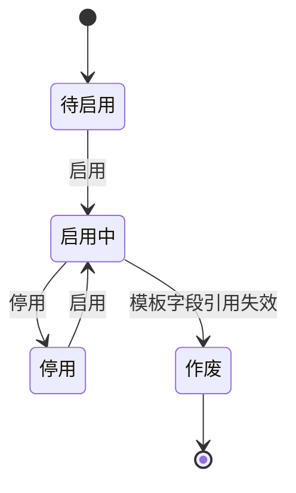
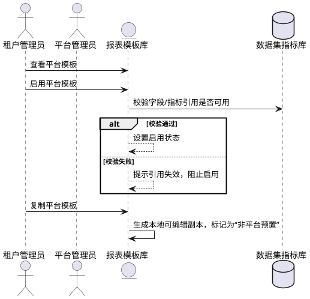
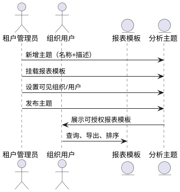
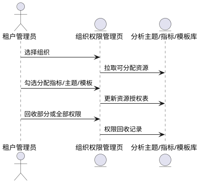
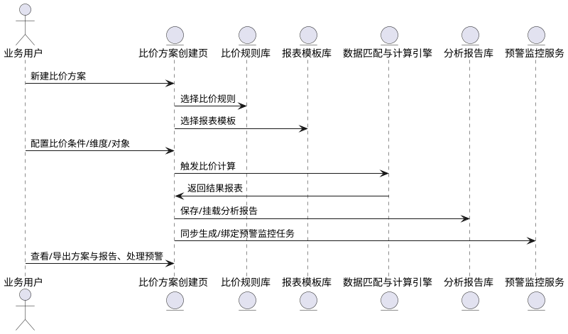
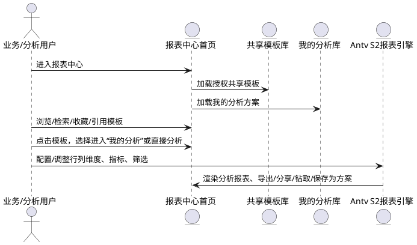
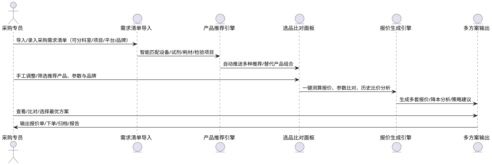

# 租户端模块

## 十二、平台模板复制与启用管理模块

### 12.1 功能概述

| 项目 | 描述 |
| --- | --- |
| 功能说明 | 平台统一维护比价分析所需的标准报表模板（如 Antv S2 透视报表模板），供租户启用、停用、复制使用。支持租户基于平台模板进行本地个性化定制（复制后全生命周期管理）。 |
| 核心目标 | 实现平台侧统一模板配置与租户端灵活复用；同时支持权限控制与字段、指标引用有效性校验。 |
| 关键用户 | 平台产品管理员、租户集团管理员、数据分析员 |
| 前置依赖准备 | 平台已创建可共享的数据集与指标定义；平台已定义至少一个模板；租户端具备对应数据权限配置模块；具备模板授权功能组件。 |

---

### 12.2 状态机

---

### 12.3 操作时序图

---

### 12.4 查询列表页面

#### 12.4.1 页面主要功能

| 功能项 | 前置条件 | 后置结果 |
| --- | --- | --- |
| 查看平台共享模板 | 登录租户管理端 | 展示所有“平台预置”模板 |
| 启用模板 | 当前模板为平台预置，状态为“待启用”或“停用” | 状态变更为“启用中” |
| 停用模板 | 当前模板状态为“启用中” | 状态变更为“停用” |
| 复制模板 | 当前模板为平台预置，租户有复制权限 | 生成“本地模板副本” |
| 编辑模板 | 当前模板为本地模板副本 | 打开编辑页面 |
| 查看引用状态 | 任一模板 | 展示字段、指标是否失效 |
| 组织与用户授权情况查看 | 任一模板 | 可查看授权清单 |

#### 12.4.2 页面字段

| 字段名称 | 字段编码 | 字段类型 | 说明 |
| --- | --- | --- | --- |
| 模板名称 | template\_name | 文本 | 报表模板展示名 |
| 模板编码 | template\_code | 唯一编码 | 系统识别用 |
| 是否平台预置 | is\_platform | 布尔 | 平台模板为“是”，本地副本为“否” |
| 当前状态 | status | 枚举 | 启用中/停用/待启用/作废 |
| 创建时间 | created\_time | 时间 | 模板创建时间 |
| 最近引用校验结果 | ref\_check\_status | 枚举 | 正常/字段失效/指标失效 |
| 创建人 | creator | 用户名 | 本地副本由租户生成 |
| 授权范围 | auth\_scope | 多选 | 展示授权组织与用户汇总 |

---

### 12.5 编辑页面

#### 12.5.1 页面字段与控件说明

| 字段名称 | 控件类型 | 说明 |
| --- | --- | --- |
| 模板名称 | 输入框 | 必填，命名规范检查 |
| 引用数据集 | 下拉框 | 从平台已授权数据集中选择 |
| 指标配置 | 拖拽组件 | 支持添加字段、表达式、复杂派生指标 |
| 条件过滤表达式 | DSL表达式框 | 动态生成条件，支持引用字段联动校验 |
| 报表组件类型 | 固定项 | 如Antv S2 |
| 模板说明 | 多行文本 | 辅助说明模板用途 |

#### 12.5.2 页面功能与校验逻辑

*   **字段引用校验**：引用字段若在数据集被删除/作废，模板标记为“作废”并提示修复建议；
    
*   **指标引用校验**：指标不存在或类型不兼容，阻止保存，提示需重新选择；
    
*   **表达式预检**：DSL表达式解析失败时，阻止保存并报错；
    
*   **校验规则实时提示**：引用字段被禁用、引用用户离职，将显示灰色状态并提示不生效；
    
*   **平台模板禁止编辑**：平台预置模板不可修改字段配置、不可更换数据集，仅可复制。
    

---

### 12.6 模板授权弹窗功能

*   **界面分为两步**：
    
    *   第一步：选择组织/用户，展示“未授权”清单；
        
    *   第二步：确认授权，添加至“已授权”列表。
        
*   **交互优化点**：
    
    *   可批量勾选组织与其下用户；
        
    *   支持模板预授权推荐（依据租户组织结构推荐常见授权范围）；
        
    *   用户授权状态绑定离职状态，若用户账号已禁用，模板授权状态自动变更为“不可用”。
        

---

### 12.7 授权校验逻辑

| 校验内容 | 处理机制 |
| --- | --- |
| 被授权用户账号已停用 | 自动取消授权，标记为“不可用”，提示更新 |
| 数据集字段/指标已作废 | 模板引用校验失败，阻止启用或编辑，提示字段失效修复 |
| 表达式引用字段已删除 | 阻止保存，提示“表达式字段引用无效” |

---

### 12.8 授权汇总查询页面

*   **主要功能**：
    
    *   可按模板、组织、用户查询所有授权记录；
        
    *   支持筛选“授权是否有效”、“授权是否已过期”、“用户是否离职”等状态；
        
    *   可一键清理无效授权记录或导出授权清单；
        
    *   支持从授权查询直接跳转至模板或用户管理模块。
        

---

## 十三、租户端 · 分析主题管理模块

### 13.1 功能概述

| 项目 | 内容 |
| --- | --- |
| 功能说明 | 本模块用于租户管理员对分析主题进行统一管理。租户管理员可将租户本地或平台共享报表模板，发布至不同的“分析主题”下进行分类聚合。分析主题不绑定数据集，仅用于聚合与分发报表模板。 |
| 关键用户 | 租户管理员 |
| 前置依赖准备 | 需已有至少一个可用的报表模板（平台复制或租户自建） |

---

### 13.2 状态机

*   草稿状态：可编辑主题名称、描述、模板挂载。
    
*   已发布：组织端可见、可用。
    
*   停用状态：组织端不再展示，仍保留数据。
    

---

### 13.3 操作时序图

---

### 13.4 分析主题列表页面

#### 13.4.1 页面主要功能

| 功能项 | 前置条件 | 后置结果 |
| --- | --- | --- |
| 新增主题 | \- | 创建草稿状态主题 |
| 编辑主题 | 状态为草稿/已发布 | 可修改名称、描述、模板挂载 |
| 发布主题 | 至少挂载一个模板 | 状态变更为“已发布”，组织端可见 |
| 停用主题 | 状态为“已发布” | 状态变更为“已停用”，组织端不可见 |
| 授权管理 | 状态为“已发布” | 设置组织/用户可用权限 |
| 删除主题 | 状态为草稿 | 删除本条记录，不可恢复 |

#### 13.4.2 页面字段清单

| 字段名称 | 字段编码 | 字段类型 | 字段说明 |
| --- | --- | --- | --- |
| 分析主题名称 | theme\_name | String | 主题的展示名称 |
| 主题编码 | theme\_code | String | 系统编码，唯一 |
| 描述信息 | description | Text | 对该主题的用途说明 |
| 授权组织数量 | auth\_org\_count | Integer | 当前主题下授权组织数量 |
| 授权用户数量 | auth\_user\_count | Integer | 当前主题下授权用户数量 |
| 报表数量 | report\_count | Integer | 挂载模板的数量 |
| 状态 | status | Enum | 草稿、已发布、已停用 |
| 是否平台预置 | is\_platform | Boolean | 是：平台模板，不可修改 |
| 创建时间 | create\_time | DateTime | \- |
| 创建人 | creator\_name | String | \- |

---

### 13.5 编辑页面功能

#### 13.5.1 页面字段与控件

| 字段名称 | 控件类型 | 说明 |
| --- | --- | --- |
| 分析主题名称 | 输入框 | 必填，唯一 |
| 主题编码 | 自动生成/只读 | 系统自动生成，不可手动编辑 |
| 描述信息 | 多行文本框 | 可选填写 |
| 模板挂载 | 多选列表 | 支持选择多个可用模板 |
| 授权范围 | 授权弹框 | 设置组织/用户权限范围（参考13.6） |

#### 13.5.2 页面功能与校验逻辑

*   模板必须至少挂载一个；
    
*   平台预置主题不允许编辑；
    
*   主题编码不能重复；
    
*   授权需至少选择一个组织或用户，否则不能发布。
    

---

### 13.6 模板授权弹框功能

#### 13.6.1 功能描述：

| 功能点 | 说明 |
| --- | --- |
| 两栏结构 | 左侧为“未授权清单”，右侧为“已授权清单” |
| 批量操作 | 可按组织、用户进行批量授权与撤回授权 |
| 离职校验 | 若被授权用户已停用账号，将标记为不可用并提示 |
| 组织授权简化 | 可支持整组织一键授权、下级自动继承 |

#### 13.6.2 页面字段

| 字段名称 | 字段编码 | 字段类型 | 说明 |
| --- | --- | --- | --- |
| 授权对象类型 | target\_type | Enum | 组织 / 用户 |
| 授权对象名称 | target\_name | String | \- |
| 是否有效 | is\_active | Boolean | 离职/失效用户会标红提醒 |
| 授权时间 | grant\_time | DateTime | \- |
| 授权来源 | grant\_source | String | 手动授权 / 平台默认授权 |

---

### 13.7 报表模板引用失效校验机制

| 校验类型 | 描述 |
| --- | --- |
| 字段不存在校验 | 若引用字段在数据集中被删除，将高亮提示模板已失效 |
| 指标表达式失效校验 | 引用的原子指标被删除或表达式不再合法时报警 |
| 模板运行时校验 | 提供运行前检测机制，避免无效报表对组织展示 |

---

### 13.8 授权汇总查询

| 功能项 | 说明 |
| --- | --- |
| 组织维度授权统计 | 展示每个组织获得的分析主题及模板数量 |
| 用户维度授权统计 | 展示用户可访问的模板列表、来源主题 |
| 离职用户回收机制 | 标记失效用户，支持回收或重新分配 |

---

## 十四、组织维度指标权限模块

---

### 14.1 功能概述

| 项目 | 描述 |
| --- | --- |
| 功能说明 | 本模块用于细化租户内各组织/部门对“分析主题”“报表模板”“指标字段”等分析资源的访问、引用和管理权限，实现多组织/多角色的数据隔离与权限灵活配置。管理员可根据组织架构，对不同组织分配不同的指标与报表分析能力。 |
| 关键用户 | 租户集团管理员、组织分析管理员、IT权限管理员 |
| 前置依赖准备 | 已有组织架构体系，分析主题、报表模板、指标字段配置完毕。 |

---

### 14.2 状态机

| 状态 | 描述 |
| --- | --- |
| 待分配 | 组织新建后，暂无指标权限 |
| 已分配 | 已分配至少一个指标/模板/主题 |
| 已回收 | 权限被主动撤回或组织/用户失效 |

---

### 14.3 权限分配/回收操作时序图

---

### 14.4 权限管理列表页面

#### 14.4.1 页面功能

| 功能 | 前置条件 | 后置结果 |
| --- | --- | --- |
| 查看组织指标权限 | 选定组织 | 列出当前所有可访问主题/模板/指标 |
| 分配指标/模板/主题 | 已有资源 | 可批量分配（支持模板分组/全选） |
| 回收/调整权限 | 有已分配权限 | 撤销或重新分配权限 |
| 导出权限清单 | \- | 权限现状一键导出 |

#### 14.4.2 页面字段

| 字段名称 | 字段编码 | 字段类型 | 说明 |
| --- | --- | --- | --- |
| 组织名称 | org\_name | String | 当前组织或部门 |
| 主题清单 | theme\_list | List | 可访问分析主题 |
| 报表模板清单 | template\_list | List | 可访问报表模板 |
| 指标字段清单 | indicator\_list | List | 可用指标 |
| 分配状态 | assign\_status | Enum | 正常/已回收/失效 |
| 授权起止时间 | grant\_time/expire\_time | Datetime | 可选，控制时效性 |
| 最后操作人 | operator | String | 操作人员 |

---

### 14.5 典型授权/回收场景与权限校验逻辑

| 场景 | 说明 |
| --- | --- |
| 新组织加入 | 默认无分析权限，需管理员分配主题/模板/指标 |
| 指标字段升级/失效 | 如引用指标被作废，权限表自动标为“失效”，需重新分配 |
| 用户离职/转岗 | 自动回收其名下分析资源权限 |
| 批量调整 | 支持跨组织、跨主题批量调整分配关系 |
| 可见性动态控制 | 按组织、岗位、用户、时间动态调整可见性 |
| 权限变更通知 | 权限调整后支持触发组织/用户通知 |

---

### 14.6 权限变更日志与审计

*   **每次分配/回收/变更均写入审计日志**，包含组织、资源、操作人、时间、操作类型。
    
*   支持权限日志筛选、导出及“可疑变更”提醒。
    

---

### 14.7 跨组织协作与继承支持

*   支持上级组织分配资源到下级组织，下级可继承/扩展其可见资源。
    
*   可设定“仅本组织可见”或“全集团共享”两类资源策略。
    

---

### 14.8 页面交互与易用性设计

*   组织树与资源分配区左右联动，勾选资源时支持自动提示下游依赖；
    
*   权限冲突时高亮提示（如：同一资源被多角色授权冲突）；
    
*   已失效/待回收/临期权限自动高亮提醒。
    

---

## 十五、比价方案创建模块

---

### 15.1 功能概述

| 项目 | 内容 |
| --- | --- |
| 功能说明 | 本模块用于业务用户、采购专员发起比价需求，配置比价规则、比价维度、筛选条件、对比对象等参数，生成可用于采购决策和审批的比价方案。支持方案与分析报告、预警监控任务自动关联，实现决策数据与风险闭环。 |
| 关键用户 | 业务用户、采购专员、数据分析员、审批流负责人 |
| 前置依赖准备 | 已拥有可用比价规则、报表模板、指标体系，数据权限已分配 |

---

### 15.2 主要流程&时序图

---

### 15.3 比价方案列表页面

#### 15.3.1 页面主要功能

| 功能 | 前置条件 | 后置结果 |
| --- | --- | --- |
| 新建比价方案 | 已有规则/模板 | 进入方案创建页 |
| 编辑比价方案 | 状态为草稿 | 修改配置 |
| 查看比价结果 | 已生成结果 | 展示对比报表、关联分析报告、预警监控摘要 |
| 查看分析报告 | 有分析报告 | 跳转分析报告详情页 |
| 查看预警监控 | 有预警监控任务 | 跳转预警详情/处置页 |
| 导出/分享方案 | 权限允许 | 导出为Excel/PDF或分享至他人 |
| 启动数据重算 | 数据有更新 | 重新计算输出最新比价结果 |
| 删除比价方案 | 草稿/无引用 | 移除比价方案 |

#### 15.3.2 页面字段

| 字段名称 | 字段编码 | 字段类型 | 说明 |
| --- | --- | --- | --- |
| 方案名称 | scheme\_name | String | 必填，命名规范 |
| 方案编码 | scheme\_code | String | 系统唯一 |
| 所用比价规则 | rule\_code | Reference | 关联比价规则 |
| 报表模板 | template\_code | Reference | 选择输出报表模板 |
| 比价维度 | compare\_dims | List | 选定维度（如SKU、品牌、方法学等） |
| 对比对象 | compare\_targets | List | 供应商、组织、品牌、价格类型等 |
| 筛选条件 | filter\_expr | DSL | 支持多条件表达式 |
| 方案状态 | status | Enum | 草稿、已发布、已归档 |
| 方案类型 | scheme\_type | Enum | 采购比价/寻源比价/审批比价等 |
| 分析报告数量 | report\_count | Integer | 自动统计，点击可查看 |
| 预警任务数量 | alert\_count | Integer | 自动统计，点击可查看 |
| 最新报告时间 | last\_report\_time | DateTime | 最近一次分析报告生成时间 |
| 最新预警时间 | last\_alert\_time | DateTime | 最近一次预警生成或更新 |
| 创建人 | creator | String | \- |
| 创建时间 | create\_time | DateTime | \- |

---

### 15.4 方案编辑与配置页面

#### 15.4.1 页面字段与控件

| 字段名称 | 控件类型 | 说明 |
| --- | --- | --- |
| 方案名称 | 输入框 | 必填 |
| 方案类型 | 下拉框 | 采购比价/寻源比价/审批比价等 |
| 比价规则 | 下拉框 | 按可用规则选择 |
| 报表模板 | 下拉框 | 可用模板列表 |
| 比价维度 | 多选框/树 | 支持按目录、品牌、型号等多选 |
| 对比对象 | 选择器 | 可选供应商、组织、价格类型等 |
| 筛选条件 | 表达式编辑器 | 字段联想、语法高亮 |
| 结果预览 | 动态报表区 | 实时展示比价结果、分析卡片 |
| 绑定分析报告 | 自动生成列表 | 可查看/跳转 |
| 关联预警任务 | 自动生成列表 | 可查看/跳转 |
| 保存/发布 | 按钮 | 状态切换 |

#### 15.4.2 功能与校验逻辑

*   必选项：比价维度、比价规则、报表模板、方案名称、类型；
    
*   筛选条件为多条件且可复用表达式，支持字段校验、类型校验；
    
*   支持选定的模板与规则字段/指标一一对应校验；
    
*   结果预览区异常高亮（如差异率>50%、倒挂、价格异常等）；
    
*   发布前校验依赖字段/指标/模板状态与权限，校验通过方可保存/发布；
    
*   自动挂载分析报告和预警任务引用，如有失效引用，红色高亮并提示修复。
    

---

### 15.5 算法与数据逻辑说明

*   支持自动聚合最优/最低/均价/异常指标，引用复杂派生/SQL型指标；
    
*   支持同产品/同类产品、供应商、组织、品牌、价格类型等多维组合；
    
*   支持与集团价、平台价、历史价等多基准对比；
    
*   报表输出与模板绑定，支持横向/纵向分析、多级钻取；
    
*   结果异常/维度缺失/权限不足有全局校验与提示机制；
    
*   可联动预警监控，结果异常可自动生成预警任务。
    

---

### 15.6 关联分析报告与预警监控联动

#### 15.6.1 分析报告查询功能

| 功能 | 描述 |
| --- | --- |
| 关联分析报告列表 | 自动关联所用报表模板生成的历史分析报告，可按报告类型、时间、指标查询、导出 |
| 分析报告预览 | 方案详情可直接进入报告页，支持筛选、分页、导出PDF/Excel |
| 历史追溯 | 每份报告保留快照，支持对比与数据穿透 |

#### 15.6.2 预警监控任务查询功能

| 功能 | 描述 |
| --- | --- |
| 关联预警任务列表 | 展示方案涉及的价格异常、倒挂风险等监控任务和状态 |
| 预警明细与状态查询 | 支持按异常等级、处理进度筛选，快速定位高风险项目 |
| 处置历史与日志联动 | 可跳转查看处置历史与日志，辅助整改与闭环 |
| 预警结果回写 | 处置结果可回写到方案备注，业务链路完整 |

#### 15.6.3 字段补充

| 字段名称 | 字段编码 | 字段类型 | 说明 |
| --- | --- | --- | --- |
| 分析报告数量 | report\_count | Integer | 方案下关联分析报告 |
| 预警任务数量 | alert\_count | Integer | 方案下关联预警任务 |
| 最新报告时间 | last\_report\_time | DateTime | 最近分析报告时间 |
| 最新预警时间 | last\_alert\_time | DateTime | 最近预警发生时间 |

---

### 15.7 场景举例

*   **业务采购比价**：导入采购需求清单，配置多个比价方案并自动出具多份报价，按品牌、价格、授权等多方案择优；
    
*   **寻源谈判比价**：针对市场新供应商或特殊业务，配置比价参数，一键生成对比报告，辅助议价/谈判；
    
*   **审批比价**：采购审批流自动带入比价结果与风险提示卡片，增强业务审批透明度与风控。
    

---

## 十六、报表分析模块（报表中心 · 含透视/明细/自定义分析）

---

### 16.1 功能概述

| 项目 | 内容 |
| --- | --- |
| 功能说明 | 本模块为业务用户、分析用户和管理者提供统一的“报表中心”入口，支持平台/集团/租户授权的所有报表模板分析，以及用户个性化“我的分析”方案管理。用户可在报表中心按主题、方案、指标、组织等多维度自定义分析，进行透视表、明细表、多模式数据钻取、导出和分享，全面赋能决策。 |
| 关键用户 | 业务用户、分析员、管理者 |
| 前置依赖准备 | 已分配报表模板和数据权限，已配置指标体系 |

---

### 16.2 报表中心结构与主流程

#### 16.2.1 报表中心主界面

*   左侧为树状/分栏结构：【共享报表模板】【我的分析】
    
    *   **共享区**：展示平台/集团/租户授权、按主题分组的所有报表模板（只读，支持引用/预览）
        
    *   **我的分析区**：用户引用、收藏、分组、二次定制的个性化报表方案（可编辑、私有/小组共享）
        
*   面包屑导航支持“主题 > 报表 > 我的方案”三级跳转，便于溯源和切换
    
*   主区为动态报表分析区，支持方案切换、参数实时渲染
    

#### 16.2.2 报表访问主流程

---

### 16.3 共享报表模板区

#### 16.3.1 主要功能

| 功能 | 说明 |
| --- | --- |
| 按主题分组展示 | 按分析主题、业务域分组，支持检索与筛选 |
| 预览/引用 | 可直接预览或“一键引用到我的分析” |
| 只读属性 | 模板区结构不可编辑，仅可引用 |
| 权限继承 | 按组织/角色/用户权限控制显示 |

---

### 16.4 我的分析区

#### 16.4.1 主要功能

| 功能 | 说明 |
| --- | --- |
| 展示所有主题/报表清单 | 自动聚合用户具备权限的主题及下属报表 |
| 分组管理 | 主题、报表支持分组、排序、归档 |
| 个性化方案编辑 | 支持对每份报表固化默认行/列维度、指标、查询条件、样式等 |
| 多方案管理 | 支持多个方案切换、重命名、导入导出、历史快照 |
| 方案分享/订阅 | 一键分享给组织/小组、支持订阅推送 |
| 历史查询/快照 | 记录历史查询参数，支持快照还原与对比 |

---

### 16.5 报表分析详情页——核心分析能力与交互

#### 16.5.1 多分析模式切换

*   **透视表模式**：任意多维组合、分组、聚合、多层级钻取，父子结构列头，支持指标、维度拖拽
    
*   **明细表模式**：一键切换底层明细视图，查看、导出全部原始数据，支持全部字段排序、筛选
    
*   **模式自由切换**：顶部按钮区一键切换，不同模式可独立保存参数与视图设置
    

#### 16.5.2 交互按钮与操作能力

| 功能/按钮 | 说明 |
| --- | --- |
| 维度/指标配置 | 拖拽添加/排序行、列、指标，自动渲染 |
| 筛选条件设置 | 多条件自由组合，支持保存常用筛选 |
| 数据刷新 | 保证分析结果实时更新 |
| 导出 | Excel、PDF、CSV、图片等一键导出 |
| 全屏展示 | 一键进入会议/大屏演示模式 |
| 钻取明细 | 支持单元格/字段下钻至明细或下级分组 |
| 样式设置 | 表头冻结、列宽、字体、配色等自定义 |
| 分组/排序 | 多级分组、任意排序 |
| 查询历史 | 历史参数一键还原、复用 |
| 收藏/方案保存 | 保存为“我的分析方案”，长期复用 |
| 快照/对比 | 保存分析快照，支持多快照历史对比 |
| 条件清空/重置 | 一键清空筛选、重置为模板默认 |
| 分享 | 生成链接（权限可控），可发送他人 |
| 订阅推送 | 定时推送、邮件/消息订阅分析结果 |

#### 16.5.3 权限与安全校验

*   所有分析、导出、钻取等均按组织/角色/字段权限实时校验
    
*   未授权字段自动屏蔽/灰显，明细/导出/钻取数据严格隔离
    

#### 16.5.4 异常提示与智能引导

*   表格与分析区顶部对数据缺失、指标配置错误、字段未授权等实时高亮、提示
    
*   智能引导常用操作、关键分析路径、新功能，提升自助体验
    

---

### 16.6 典型业务场景与自定义能力（举例）

*   按SKU、组织、供应商、时间等多维分析采购价、协议价、倒挂风险等
    
*   任意主题下任意分析指标自由组合、筛选、分组
    
*   支持不同用户、不同小组/部门个性化保存常用分析方案
    
*   支持跨主题、跨报表数据对比与多快照趋势分析
    
*   明细表与透视表模式自由切换，支持全链路数据穿透与追溯
    

---

## 十七、推荐选品与报价方案模块

---

### 17.1 功能概述

| 项目 | 内容 |
| --- | --- |
| 功能说明 | 本模块基于用户导入的采购需求清单（或手工选择），结合集团推荐策略、产品/设备/试剂目录、检验项目与参数适配关系、历史采购数据与实时价格比对，智能推荐最优产品组合与替代方案。系统自动完成产品比对、参数适配、智能测算价格与综合成本，输出多套报价与选型比对方案，支持业务快速决策和自动生成可下单的报价单。 |
| 关键用户 | 采购专员、业务负责人、集团采购决策者 |
| 前置依赖准备 | 已有主数据目录（设备/试剂/耗材/项目）、产品参数与适配关系、历史采购数据、可用价格池、授权规则等 |

---

### 17.2 核心业务流程与场景

#### 17.2.1 流程时序图

---

### 17.3 推荐选品与比对核心能力

| 能力 | 说明 |
| --- | --- |
| 需求清单智能解析 | 支持多格式导入/录入，自动归类科室、项目、设备、品牌 |
| 推荐标签与规则 | 集团可配置推荐标签（优先品牌、适配目录、授权可用性等），设定智能筛选/替换策略 |
| 参数与适配匹配 | 支持设备-试剂-检验项目全链路适配、技术参数自动对比 |
| 历史采购数据关联 | 智能引用集团/组织历史价格、协议、授权、合规信息 |
| 智能比价与测算 | 选品后自动调用第十六章分析能力，动态比对价格、差异、降本幅度 |
| 多方案生成与比对 | 支持多套产品组合自动推荐与一键比对（按品牌、降本、授权、兼容性等多策略） |
| 一键输出报价单 | 支持导出Excel/PDF标准报价单，方案明细、参数、比价分析报告 |

---

### 17.4 主要页面与功能结构

#### 17.4.1 需求清单导入/选择页面

| 功能 | 说明 |
| --- | --- |
| 需求清单导入 | 支持Excel/模板批量导入，科室/项目/设备/品牌分类录入 |
| 智能补全与推荐 | 根据部分信息自动匹配产品、检验项目、适配参数 |
| 清单预览与分组 | 支持多维分组、筛选、查询、去重、修正 |

#### 17.4.2 推荐选品与比对面板

| 功能 | 说明 |
| --- | --- |
| 智能推荐产品组合 | 按导入清单自动生成多套推荐产品组合与替换方案 |
| 设备-试剂/耗材适配 | 展示所有适配产品与参数，支持一键比对与手工微调 |
| 参数与品牌筛选 | 可按技术参数、品牌、授权、价格区间灵活筛选 |
| 多方案比对 | 横向展示多套方案，支持参数/价格/授权/降本等维度高亮对比 |
| 一键推送到报价测算 | 选定方案后可一键调用测算报价功能，自动生成价格分析 |

#### 17.4.3 报价测算与方案输出页面

| 功能 | 说明 |
| --- | --- |
| 智能报价测算 | 自动引用最新价格池、历史协议价、集团价、人工成本等测算综合报价 |
| 综合成本与降本分析 | 展示每方案降本幅度、价格差异率、授权/合规等风险提示 |
| 方案导出与归档 | 导出标准报价单、明细、对比报告；支持归档入库与溯源 |
| 下单与流转 | 可选集成下单/流转/审批接口，支持后续采购链条自动衔接 |

---

### 17.5 典型业务场景

*   临床科室批量需求导入，系统自动推荐最优设备-试剂-耗材组合及报价；
    
*   集团/组织定向采购谈判前，系统自动生成多套选品组合与降本分析；
    
*   比对历史采购、协议价与市场价，智能判别风险并给出策略建议；
    
*   输出标准化报价单，自动带出参数、合规、授权等全维度明细；
    
*   多套方案横向比对，支持专家/业务协同决策。
    

---

### 17.6 技术与前端集成说明

*   推荐引擎可调用AI算法、规则引擎与产品参数知识图谱；
    
*   比对与测算直接复用第十六章S2分析/报表能力，方案可推送到报表中心；
    
*   报价单输出、归档、下单可与SRM/ERP/采购业务平台自动集成。